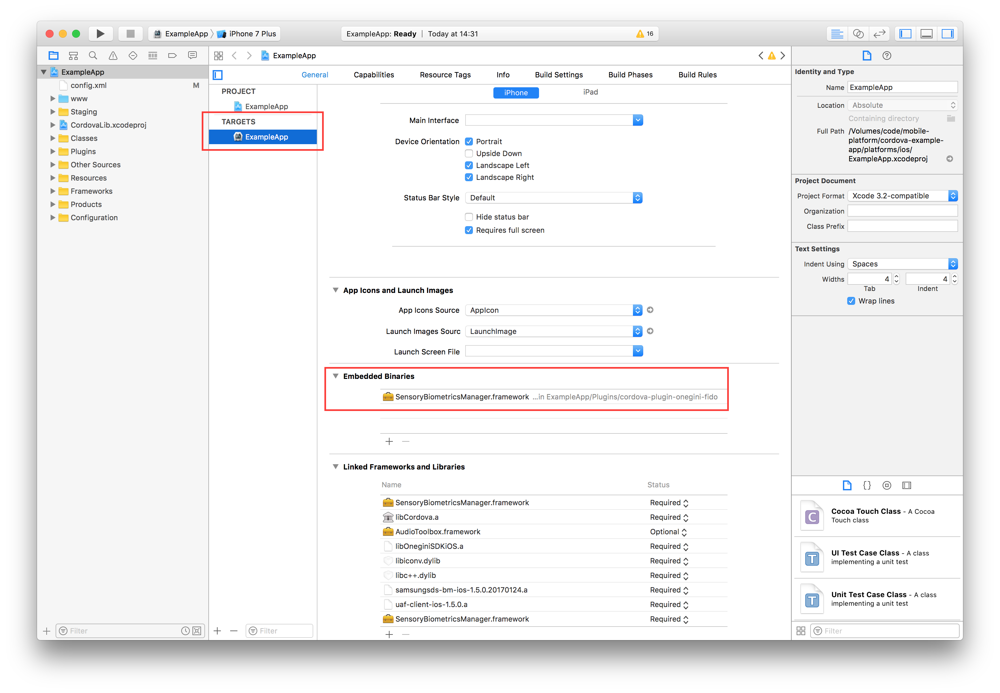

# User authentication with fingerprint

<!-- toc -->

## Introduction

The Onegini Cordova plugin allows you to authenticate users with [FIDO UAF authenticators](), if one is available on the device and you have performed the steps 
described in this topic guide. FIDO authenticators can be used for both regular authentication as well as mobile authentication.

FIDO authentication is not a standard feature of the Onegini Mobile Security Platform. It is licensed separately since it is also depending on other 
third-party software.

## Enabling FIDO authentication

In order to enable FIDO authentication for your application you must add an additional Cordova plugin to your application project.

```bash
cordova plugin add https://github.com/Onegini/cordova-plugin-onegini-fido
```

> *INFO*: It is very important that you add the FIDO plugin before you add the normal Onegini Cordova plugin (cordova-plugin-onegini). Due to the way that dependencies are resolved this is very 
important. If you don't do that FIDO authentication will not work.
> An example:
>```bash
>cordova plugin add https://github.com/Onegini/cordova-plugin-onegini-fido https://github.com/Onegini/cordova-plugin-onegini
>```

### Setting up iOS

Because Cordova does not support an embedded binary out of the box, you must manually modify the Xcode project before you are able to build & run your 
application.

The `SensoryBiometricsManager.framework` must be added as an 'embedded binary' to your application target. See the image below for an example:



## Registering a FIDO authenticator

In order to register a FIDO authenticator for a user, the Onegini Cordova plugin provides the [`onegini.user.authenticators.registerNew`](../reference/user/authenticators.md#oneginiuserauthenticatorsregisternew). 
As a result, it is necessary to implement the UI associated with the `onPinRequest` method, in addition to the `onSuccess` and `onError` methods. As part of the 
FIDO authenticator registration flow the user is asked to perform a certain action. This could for instance be provide his face in front of the camera 
(for face authentication) or put his finger on the fingerprint scanner (for FIDO fingerprint authentication).

**Example code for registering a FIDO authenticator:**

```js

// we need to lookup one of the FIDO authenticators. There could be multiple FIDO authenticators that are not registered for a specific user
var fidoAuthenticator;
onegini.user.authenticators.getNotRegistered(
    {
      profileId: "profileId"
    },
    function (result) {
      for (var r in result) {
        var authenticator = result[r];
        if (authenticator.authenticatorType === "FIDO") {
          fidoAuthenticator = authenticator;
        }
      }
    },
    function (err) {
      alert("Error!\n\n" + err.description);
    });

onegini.user.authenticators.registerNew({ fidoAuthenticator })
    .onSuccess(() => {
      alert("Success!");
    })
    .onError((err) => {
      alert("Error!\n\n" + err.description);
    });
```

FIDO authentication may not be available on every device. In this case, or if the authenticator has already been registered, the above method will return an error. 
Please verify the specifications of the FIDO authenticators to see which authenticators should be working on the device that you are using. FIDO will not work 
on a simulator. 

To request a list of available authenticators that have not yet been registered, the plugin exposes the [`onegini.user.authenticators.getNotRegistered`](../reference/user/authenticators.md#oneginiuserauthenticatorsgetnotregistered)
function, which takes the `profileId` of the desired user as argument. If the device does not meet the FIDO requirements, the FIDO authenticator will not be 
present in the returned array of of authenticators.

Note that registering a new authenticator does not set it as the preferred authenticator for the user, which is PIN by default. 
To change this, [`onegini.user.authenticators.setPreferred`](../reference/user/authenticators#oneginiuserauthenticatorssetpreferred) can be used.